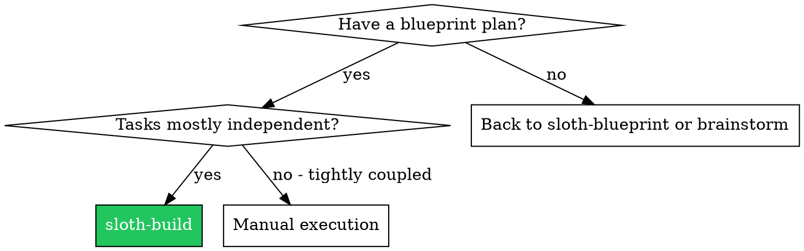
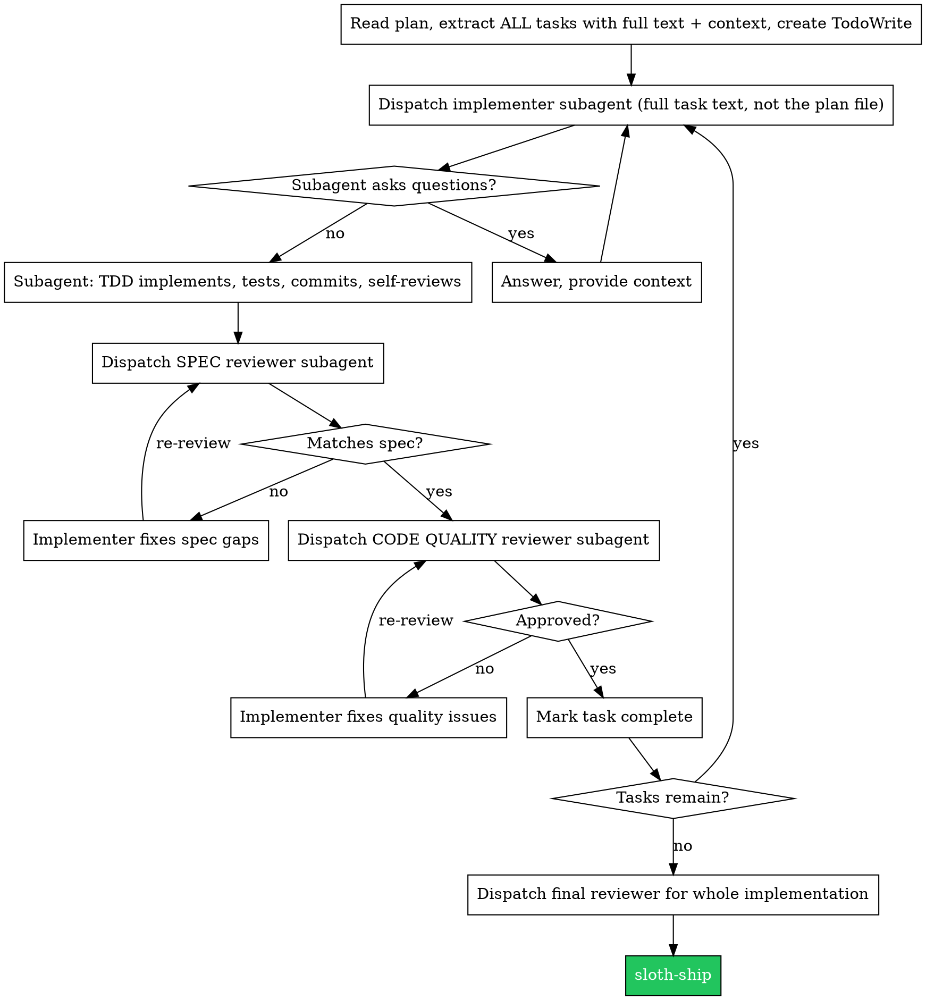

# Sloth Build — The Execution Engine 🦥

## Overview

This is the engine the /deliver pipeline calls to turn a [sloth-blueprint](../sloth-blueprint/SKILL.md)
plan into shipped code. Dispatch a fresh subagent per task, then run TWO-STAGE review:
spec compliance FIRST, then code quality — in that order, every task.

**Why subagents:** you delegate each task to a focused agent with isolated context. By crafting
exactly the instructions and context it needs, it stays on-task and your own context stays clean
for coordination. Subagents never inherit your session history — you construct what they need.

**Core principle:** Fresh subagent per task + two-stage review (spec then quality) = high quality, fast iteration.

**Continuous execution:** Do not pause to check in with Corey between tasks. Run all tasks from
the plan. Only stop for: an unresolvable BLOCKED status, genuine ambiguity, or all tasks done.
"Should I continue?" prompts waste the client's time — they asked you to execute the plan.

## When to Use

**vs. manual execution:** subagents follow TDD naturally, get fresh context per task, are
parallel-safe, and can ask questions before AND during work.

## The Process

## Model Selection

Use the least powerful model that can do each role. 1-2 files with a complete spec → cheap, fast
model (most well-specified tasks are mechanical). Multi-file integration/debugging → standard
model. Architecture, design, and review judgment → most capable model.

## The Three Subagent Roles (inline — this skill is standalone)

### Implementer subagent

Give it: the **full task text** (never the plan file path), scene-setting context for where the
task fits, relevant existing patterns/files, and the acceptance criteria. Tell it to follow
[sloth-tdd](../sloth-tdd/SKILL.md) — failing test first, minimal code, then refactor — commit
its work, and self-review before reporting. It reports one of four statuses (below).

### Spec reviewer subagent (runs FIRST)

Give it: the original task spec/requirements and the commit range (`BASE_SHA`..`HEAD_SHA`). Its
ONLY job is "does the code do exactly what the spec asked — nothing missing, nothing extra?"
It flags **missing** requirements and **unrequested** additions (scope creep). It does NOT judge
code style. Output: spec-compliant ✅, or a list of gaps/extras.

### Code quality reviewer subagent (runs SECOND, only after spec ✅)

Give it: the same commit range plus a one-line description of what was built. It checks
correctness, test quality (real assertions, watched-them-fail), readability, naming, duplication,
error handling, and magic numbers. Output: strengths + issues tagged Critical / Important / Minor,
and an approve/iterate verdict.

## Handling Implementer Status

- **DONE** → proceed to spec review.
- **DONE_WITH_CONCERNS** → read the concerns. Correctness/scope concerns: address before review.
  Observations ("file getting large"): note and proceed.
- **NEEDS_CONTEXT** → provide the missing info, re-dispatch.
- **BLOCKED** → assess: context problem → add context, same model; needs more reasoning →
  re-dispatch with a more capable model; too large → split it; plan is wrong → escalate to Corey.

**Never** ignore an escalation or force the same model to retry unchanged. If it's stuck, something must change.

## Red Flags

**Never:**
- Start implementation on main/master without explicit consent
- Skip either review (spec OR quality)
- **Start code quality review before spec compliance is ✅** (wrong order)
- Move to the next task with either review's issues still open
- Dispatch multiple implementer subagents in parallel (conflicts)
- Make a subagent read the plan file (provide full text instead)
- Skip scene-setting context, or ignore a subagent's questions
- Accept "close enough" on spec compliance, or skip a re-review after a fix
- Let the implementer's self-review replace actual review (both are needed)

**If a reviewer finds issues:** the same implementer subagent fixes them, then the reviewer
reviews again — repeat until approved.

**If a subagent fails the task:** dispatch a fix subagent with specific instructions. Don't fix
manually (context pollution).

## Example: AOS Sober Living booking app

Blueprint has 5 tasks. **Task 2: bed-availability check before booking.**
- Dispatch implementer with the full task text + the Supabase `bookings`/`beds` schema. It writes
  a failing test (double-booking should reject), implements the availability query, commits.
- Spec reviewer: ❌ "Missing: spec says block overlapping date ranges; only exact-date overlap is
  checked. Extra: added an unrequested `--force` override." Implementer fixes both. Re-review: ✅.
- Code quality reviewer: Important — magic number for max beds per room. Implementer extracts a
  `MAX_BEDS` constant. Re-review: ✅. Mark Task 2 complete, move to Task 3.

## Integration with the Maycrest roster

- Plans come from [sloth-blueprint](../sloth-blueprint/SKILL.md); finish via [sloth-ship](../sloth-ship/SKILL.md).
- Run inside an isolated [sloth-worktree](../sloth-worktree/SKILL.md).
- Every implementer subagent follows [sloth-tdd](../sloth-tdd/SKILL.md); reviewers use
  [sloth-review](../sloth-review/SKILL.md)'s context recipe.
- For specialized tasks (Supabase, Expo, Next.js), the implementer can be a `maycrest-automate` specialist.
- Hand the finished implementation to `maycrest-ops:reality-checker` for the production-readiness verdict.

---
*Adapted from the MIT-licensed [obra/superpowers](https://github.com/obra/superpowers) project (© 2025 Jesse Vincent). See [NOTICE](../../NOTICE).*
