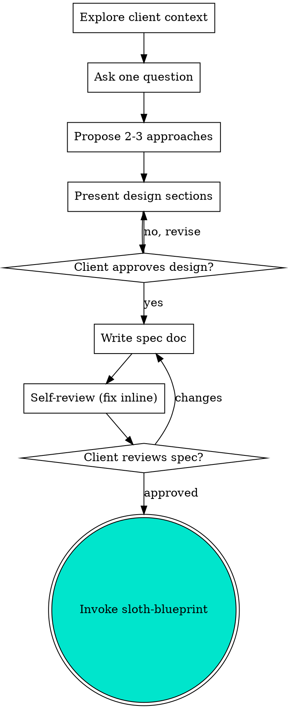

# Sloth Spec — The Agency Front Door 🦥

## Overview

Every Maycrest engagement starts here. Turn a fuzzy client ask into a fully formed,
*written, approved* spec through natural collaborative dialogue. We do not move metal —
no code, no scaffolding, no implementation action — until the spec is approved.

**Core principle:** Unexamined assumptions are where billable hours go to die.

## The Hard Gate

```
NO BUILD ACTION UNTIL THE WRITTEN SPEC IS APPROVED BY CHANGE/COREY
```

Do NOT invoke any implementation skill, write code, scaffold a project, or take any
build action until you have presented a design and the client/Corey has approved it.
**This applies to EVERY engagement regardless of perceived simplicity.**

Thinking "this one's obvious, I'll just start"? Stop. That's the rationalization that
ships the wrong thing to a paying client.

## Anti-Pattern: "Too Simple To Need a Spec"

A todo list, a single Supabase function, a config tweak — all of them go through this
process. "Simple" jobs are exactly where unexamined assumptions cause the most rework.
The spec can be short (a few sentences for truly simple work), but you MUST present it
and get approval.

## Process Flow



**The terminal state is invoking [sloth-blueprint](../sloth-blueprint/SKILL.md).** Do NOT
invoke any implementation skill. The ONLY skill you invoke after sloth-spec is sloth-blueprint.

## Checklist (complete in order)

1. **Explore client context** — files, docs, recent commits, the existing stack.
2. **Scope check** — if the ask spans multiple independent subsystems (chat + billing +
   analytics), flag it and decompose into sub-projects first. Each gets its own spec → plan → build.
3. **Ask clarifying questions** — one at a time, multiple-choice preferred. Focus on
   purpose, constraints, success criteria.
4. **Propose 2-3 approaches** — with trade-offs; lead with your recommendation and why.
5. **Present the design** — in sections scaled to complexity; get approval after each section.
   Cover architecture, components, data flow, error handling, testing.
6. **Write the spec doc** — `docs/specs/YYYY-MM-DD-<topic>-spec.md`, commit it.
7. **Self-review** — scan for placeholders, contradictions, ambiguity, scope creep; fix inline.
8. **Client reviews the written spec** — wait for approval before proceeding.
9. **Transition to planning** — invoke sloth-blueprint.

## Design for Isolation and Clarity

- Break the system into small units with one clear purpose and well-defined interfaces.
- For each unit, answer: what does it do, how do you use it, what does it depend on?
- Can someone understand a unit without reading its internals? Can you change the internals
  without breaking consumers? If not, the boundaries need work.
- In existing codebases, follow established patterns. Fix problems that affect the work;
  don't bolt on unrelated refactoring.

## Self-Review (fresh eyes on the spec)

1. **Placeholder scan** — any "TBD", "TODO", vague requirements? Fix them.
2. **Internal consistency** — do sections contradict each other? Does architecture match features?
3. **Scope check** — focused enough for one plan, or does it need decomposition?
4. **Ambiguity check** — could a requirement be read two ways? Pick one, make it explicit.

Fix inline, then hand the file to the client:

> "Spec written and committed to `<path>`. Please review it and let me know if you want
> any changes before we move to the implementation plan."

## Key Principles

- **One question at a time** — don't overwhelm.
- **Multiple choice preferred** — easier to answer.
- **YAGNI ruthlessly** — cut features that don't serve the goal.
- **Explore alternatives** — always 2-3 approaches before settling.
- **Incremental validation** — present, get approval, move on.

## Example: AOS Sober Living booking app

Client ask: "We need a way for residents to book the house van."

- **Explore** — confirmed the stack (Expo + Supabase, existing resident auth).
- **One question at a time** — Recurring bookings or single? → Single. Conflicts allowed? → No,
  one van. Who approves? → House manager, async.
- **Two approaches** — (A) full calendar UI with realtime, (B) simple request-then-approve list.
  Recommended B: ships faster, matches the actual workflow. Client picked B.
- **Design** — `van_bookings` table + RLS, request screen, manager approval queue, push on approval.
- **Spec written** to `docs/specs/2026-06-19-van-booking-spec.md`, committed, client approved.
- **Terminal step** — invoked [sloth-blueprint](../sloth-blueprint/SKILL.md).

## Integration with the Maycrest roster

- Terminal handoff is always [sloth-blueprint](../sloth-blueprint/SKILL.md) — never an implementer.
- The blueprint structures every task around [sloth-tdd](../sloth-tdd/SKILL.md).
- For UI-heavy specs, pull design direction from `maycrest-create` before locking the design.
- Implementation later runs through `maycrest-automate` specialists via [sloth-build](../sloth-build/SKILL.md).

---
*Adapted from the MIT-licensed [obra/superpowers](https://github.com/obra/superpowers) project (© 2025 Jesse Vincent). See [NOTICE](../../NOTICE).*
