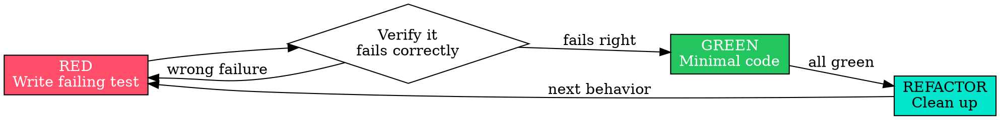

# Sloth TDD — Test-First Discipline 🦥

## Overview

Write the test first. Watch it fail. Write minimal code to pass. At Maycrest we hand
verified work to SMB clients who trust us — untested code is a liability we don't ship.

**Core principle:** If you didn't watch the test fail, you don't know it tests the right thing.

**Violating the letter of this rule is violating the spirit of this rule.**

## When to Use

**Always:** new features, bug fixes, refactors, behavior changes — on any Maycrest build
(client apps, the Maycrest website, internal tooling).

**Exceptions (ask Corey):** throwaway prototypes, generated code, configuration files.

Thinking "skip TDD just this once for this client"? Stop. That's rationalization.

## The Iron Law

```
NO PRODUCTION CODE WITHOUT A FAILING TEST FIRST
```

Wrote code before the test? Delete it. Start over.

**No exceptions:** don't keep it as "reference," don't "adapt" it while writing the test,
don't look at it. Delete means delete. Implement fresh from the test.

## Red-Green-Refactor



- **RED** — one minimal test for one behavior, clear name, real code (mocks only if unavoidable).
- **Verify RED (mandatory)** — run it. Confirm it *fails* for the expected reason (feature
  missing, not a typo). Passes immediately? You're testing existing behavior — fix the test.
- **GREEN** — the simplest code that passes. No extra features, no gold-plating. YAGNI.
- **Verify GREEN (mandatory)** — run it. Test passes, other tests still pass, output pristine.
- **REFACTOR** — only when green: remove duplication, improve names, extract helpers. Stay green.

## Common Rationalizations

| Excuse | Reality |
|--------|---------|
| "Client deadline — no time for tests" | TDD is faster than debugging in front of the client. |
| "Too simple to test" | Simple code breaks. The test takes 30 seconds. |
| "I'll test after the demo" | Tests written after pass immediately and prove nothing. |
| "Already spent hours, deleting is wasteful" | Sunk cost. Keeping unverified code is the waste. |
| "I manually tested it in the Expo preview" | Ad-hoc ≠ systematic. No record, can't re-run. |
| "This client is different because…" | It isn't. Write the test first. |

## Red Flags — STOP and Start Over

- Code before test
- Test passes immediately
- Can't explain why the test failed
- "Keep it as reference" / "adapt the existing code"
- "It's about spirit, not ritual"

**All of these mean: delete the code, start over with TDD.**

## Example: AOS Sober Living intake form

**Bug:** empty client email is accepted on the intake form.

**RED**
```typescript
test('rejects empty email on intake', async () => {
  const result = await submitIntake({ email: '' });
  expect(result.error).toBe('Email required');
});
```
**Verify RED** → `FAIL: expected 'Email required', got undefined` (good — the guard is missing).

**GREEN**
```typescript
function submitIntake(data: IntakeData) {
  if (!data.email?.trim()) return { error: 'Email required' };
  // ...persist to Supabase
}
```
**Verify GREEN** → `PASS`. **REFACTOR** → extract field validation if more fields need it.

## Integration with the Maycrest roster

- Subagents in [sloth-build](../sloth-build/SKILL.md) follow this skill on every task.
- Confirm completion with [sloth-verify](../sloth-verify/SKILL.md) before claiming done.
- Hand the certified build to `maycrest-ops:reality-checker` for the production-readiness verdict.

---
*Adapted from the MIT-licensed [obra/superpowers](https://github.com/obra/superpowers) project (© 2025 Jesse Vincent). See [NOTICE](../../NOTICE).*
